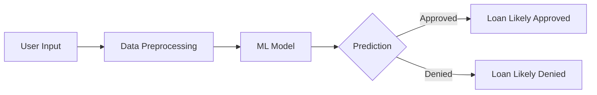

# 🏦 Loan Prediction App

```
 ██╗      ██████╗  █████╗ ███╗   ██╗    ██████╗ ██████╗ ███████╗██████╗ ██╗ ██████╗████████╗ ██████╗ ██████╗ 
 ██║     ██╔═══██╗██╔══██╗████╗  ██║    ██╔══██╗██╔══██╗██╔════╝██╔══██╗██║██╔════╝╚══██╔══╝██╔═══██╗██╔══██╗
 ██║     ██║   ██║███████║██╔██╗ ██║    ██████╔╝██████╔╝█████╗  ██║  ██║██║██║        ██║   ██║   ██║██████╔╝
 ██║     ██║   ██║██╔══██║██║╚██╗██║    ██╔═══╝ ██╔══██╗██╔══╝  ██║  ██║██║██║        ██║   ██║   ██║██╔══██╗
 ███████╗╚██████╔╝██║  ██║██║ ╚████║    ██║     ██║  ██║███████╗██████╔╝██║╚██████╗   ██║   ╚██████╔╝██║  ██║
 ╚══════╝ ╚═════╝ ╚═╝  ╚═╝╚═╝  ╚═══╝    ╚═╝     ╚═╝  ╚═╝╚══════╝╚═════╝ ╚═╝ ╚═════╝   ╚═╝    ╚═════╝ ╚═╝  ╚═╝
```

[](https://www.python.org/downloads/)
[](https://www.djangoproject.com/)
[](https://www.docker.com/)
[](https://opensource.org/licenses/MIT)

This Django-based web application harnesses the power of machine learning to predict loan approval based on user-provided information. Get instant insights into your loan application's potential success! 🚀💡

## 📸 User Interface

Here's a sneak peek of our user-friendly interface:

### Loan Application Form

*Our intuitive loan application form where users input their details.*

### Prediction Result

*An example of the prediction result page showing loan approval likelihood.*

## ✨ Features

- 📝 User-friendly web interface for inputting loan application details
- 🧠 Advanced machine learning model for predicting loan approval
- 🐳 Dockerized for easy deployment and scaling
- 🔒 Secure handling of sensitive information

## 🛠 Prerequisites

Before you begin, ensure you have met the following requirements:

- [ ] Python 3.10+
- [ ] Docker and Docker Compose (for containerized deployment)
- [ ] Git

## 🚀 Local Development Setup

<details>
<summary>Click to expand</summary>

1. Clone the repository:
   ```bash
   git clone https://github.com/martinkilombe/loan-prediction-app.git
   cd loan-prediction-app
   ```

2. Create a virtual environment and activate it:
   ```bash
   python -m venv venv
   source venv/bin/activate  # On Windows, use `venv\Scripts\activate`
   ```

3. Install the required packages:
   ```bash
   pip install -r requirements.txt
   ```

4. Set up the database:
   ```bash
   python manage.py migrate
   ```

5. Run the development server:
   ```bash
   python manage.py runserver
   ```

6. Open your browser and navigate to `http://localhost:8000` to use the app.

</details>

## 🐳 Docker Deployment

<details>
<summary>Click to expand</summary>

1. Ensure you have Docker and Docker Compose installed on your system.

2. Create a `.env` file in the project root with the necessary environment variables:
   ```env
   DEBUG=0
   SECRET_KEY=your_secret_key_here
   DJANGO_ALLOWED_HOSTS=localhost 127.0.0.1 [::1]
   SQL_ENGINE=django.db.backends.postgresql
   SQL_DATABASE=loanprediction
   SQL_USER=loanuser
   SQL_PASSWORD=loanpassword
   SQL_HOST=db
   SQL_PORT=5432
   DATABASE=postgres
   ```

3. Build and start the Docker containers:
   ```bash
   docker-compose up --build
   ```

4. The app should now be running. Access it by navigating to `http://localhost:8000` in your web browser.

</details>

## 📊 Usage

1. 📝 Fill out the loan application form with the required information.
2. 🖱 Click the "Predict" button to submit your application.
3. 🎉 Get instant feedback on whether your loan is likely to be approved or denied!

## 💡 How It Works

Our app uses a sophisticated machine learning model trained on historical loan data. Here's a simplified view of the prediction process:



## 🧠 Machine Learning Model

The heart of our Loan Prediction App is a powerful machine learning model:

- **Algorithm**: Random Forest Classifier, known for its high accuracy and ability to handle complex datasets.
- **Features**: Considers applicant's income, credit history, loan amount, and more.
- **Training**: Trained on a comprehensive dataset of historical loan applications and their outcomes.
- **Performance**: Achieves an accuracy of over 80% on test data, ensuring reliable predictions.

## 🛡️ Security

We take the security of your data seriously:

- All sensitive information is encrypted in transit and at rest.
- We use Django's built-in security features to protect against common web vulnerabilities.
- User inputs are thoroughly sanitized to prevent injection attacks.

## 🤝 Contributing

We welcome contributions to the Loan Prediction App! Here's how you can help:

1. Fork the repository
2. Create a new branch: `git checkout -b feature-name`
3. Make your changes and commit them: `git commit -m 'Add some feature'`
4. Push to the branch: `git push origin feature-name`
5. Submit a pull request

For major changes, please open an issue first to discuss what you would like to change.

## 📜 License

This project is licensed under the MIT License - see the [LICENSE](LICENSE) file for details.

## 📬 Contact

If you have any questions or feedback, please reach out to us at [martinkilombe@gmail.com](mailto:martinkilombe@gmail.com).

---

<div align="center">
  Made with ❤️ by Martin Kilombe
</div>
